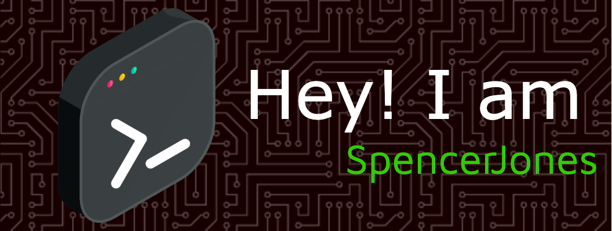

<!-- Header Image -->

  

<!-- About Me Section -->
<h2 align="center">🌟 About Me</h2>

  <!-- Social Media -->
  <a href="https://instagram.com/makes.spence">
    
  
  
  
  <a href="https://pinterest.com/jonesspencer99">
    
  <!-- Developer / Professional Platforms -->
  
  
  
  
  

<!-- Bio & Dev Quote -->
<table width="100%" align="center">
  <tr>
    <td valign="center">
<!-- Bio -->
<ul>
  <li>💫 I currently reside in Norristown, Pennsylvania</li>
  <li>🔭 I’m working remotely as an Application Support Analyst</li>
  <li>📚 Pursuing my Master’s in Computer Science</li>
  <li>🎸 In my free time, I enjoy playing guitar</li>
</ul>
  </td>
  <td valign="top" align="center">
<!-- Dev Quote -->

  </td>
</tr>
</table>

 <!-- Technical Information Section -->
<h2 align="center">🧑‍💻 Tech Stack</h2>
<table width="100%" align="center">
  <tr>
    <td align="center"><b>💻 Programming Languages</b></td>
    <td align="center"><b>⚙️ Frameworks & Libraries</b></td>
    <td align="center"><b>☁️ Cloud Platforms</b></td>
    <td align="center"><b>🧰 DevOps & CI/CD</b></td>
  </tr>
  <tr>
    <!-- Programming Languages -->
    <td align="center">
      
      
      
      
      
      
      
      
      
      
    </td>
    <!-- Frameworks & Libraries -->
    <td align="center">
      
      
      
      
      
      
      
      
      
      
    </td>
    <!-- Cloud Platforms -->
    <td align="center">
      
      
      
      
    </td>
    <!-- DevOps & CI/CD -->
    <td align="center">
      
      
      
      
      
      
    </td>
  </tr>
  <tr>
    <td align="center"><b>🗃️ Databases</b></td>
    <td align="center"><b>🎨 Design & UI</b></td>
    <td align="center"><b>📈 Data Science & Analytics</b></td>
    <td align="center"><b>🎮 Game Development</b></td>
  </tr>
  <tr>
    <!-- Databases -->
    <td align="center">
      
      
      
      
      
      
    </td>
    <!-- Design & UI -->
    <td align="center">
      
      
      
      
      
    </td>
    <!-- Data Science & Analytics -->
    <td align="center">
      
      
      
      
    </td>
    <!-- Game Development -->
    <td align="center">
      
    </td>
  </tr>
</table>

<!-- GitHub Stats Section -->
<h2 align="center">📊 GitHub Stats</h2>

  
  
  

---
