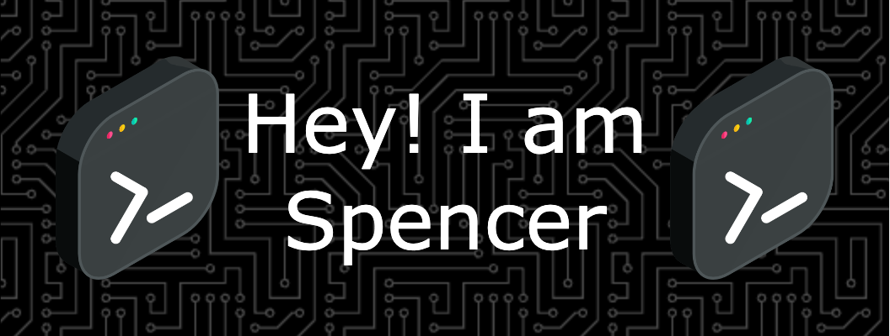

  

<h3 align="left">👩‍💻  About Me</h3>
💫 I currently reside in Norristown, Pennsylvania   
🔭 I’m working remotely as an Application Support Analyst  
📚 Pursuing my Master’s in Computer Science    
🸠In my free time, I enjoy playing guitar    
📫 Reach me at: SpencerVJones@outlook.com   

--- 

### 🌐 Socials:
 
 
 
 
 

---

### 💻 Tech Stack:
#### 🧑‍💻 Programming Languages

 
   
   
   
   
   
   
   
   

   
   

#### ⚙️ Frameworks & Libraries

 
   
   
  
   
   
  
  
   
   
   
  
   

#### ☁️ Cloud Platforms

 
   
   
   
   

#### 🧰 DevOps & CI/CD Tools

 
   
   
  
  <!-- Custom icons using URLs --> 
   
   
   

  

#### 🗃️ Databases

 
   

  <!-- Custom icon using URL --> 
   
  
  
   
   
   

#### 🎨 Design & UI Tools

 
   
  
  
  
  <!-- Custom icon using URL --> 
  
  
   

#### 📊 Data Science & Analytics

 
   

  <!-- Custom icons using URLs --> 
  
   
  

#### 🎮 Game Development

 
   

---

### 📊 GitHub Stats:

